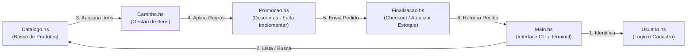

# Carrinho de Compras - Haskell

Projeto desenvolvido para a disciplina **Paradigmas de Linguagens da Programação (PLP)**. O sistema simula a lógica de backend de um e-commerce com catálogo de produtos, controle de carrinho de compras, cadastro/login de usuários e finalização de pedido (checkout).

---

## Descrição dos Módulos e Arquivos

O projeto é estruturado de forma puramente funcional, onde cada arquivo representa um módulo lógico:

*   **`Types.hs`**: Contém as definições de tipos básicas compartilhadas por todo o projeto, como o tipo `Produto` (incluindo ID, nome, preço, descrição, estoque e categoria) e os tipos de dicionário `Catalogo` e `Carrinho`. *Este arquivo é importado por todos os outros módulos para unificar a comunicação.*
*   **`Usuario.hs`**: Controla o cadastro de clientes, busca de usuários e autenticação de login (validação de e-mail e senha).
*   **`Carrinho.hs`**: Contém a lógica de manipulação direta do carrinho, permitindo visualizar itens formatados, adicionar com validação de estoque, remover por completo e alterar a quantidade.
*   **`Catalogo.hs`**: Módulo de gerenciamento e consulta do estoque global de produtos, permitindo buscar itens por categoria, buscar por nome, listar apenas produtos disponíveis em estoque e atualizar a quantidade de um produto.
*   **`Finalizacao.hs`**: Módulo que gerencia o fechamento da compra. Ele valida o carrinho, calcula o valor total, desconta os itens do estoque geral no catálogo e gera um `ResumoPedido` estruturado com uma mensagem de recibo pronta para exibição.
*   **`Promocao.hs` (Falta implementar)**: Módulo planejado para gerenciar regras de desconto (ex: cupons de desconto, "Compre 3 e Pague 2", ou promoções automáticas aplicadas a determinadas categorias de produtos).

---

## Fluxo de Funcionamento do Sistema

O diagrama abaixo ilustra o fluxo lógico de execução do sistema, desde a entrada do usuário até o checkout:

